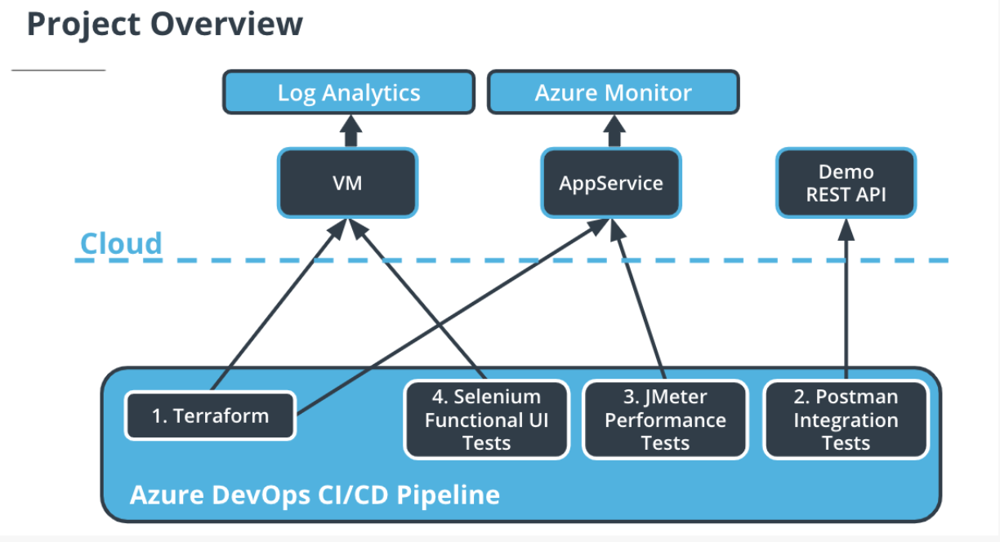

# Udacity Nanodegree: Cloud DevOps using Microsoft Azure - Project 3: Ensuring Quality Releases

## Table of Contents

- [Overview](#overview)
- [Getting Started](#getting-started)
- [Dependencies](#dependencies)
- [Instructions](#instructions)
  - [Login with Azure CLI](#login-with-azure-cli)
  - [Configure the storage account and state backend](#configure-the-storage-account-and-state-backend)
  - [Configuring Terraform](#configuring-terraform)
  - [Executing Terraform](#executing-terraform)
  - [Setting up Azure DevOps](#setting-up-azure-devops)
  - [Configuring the VM as a Resource](#configuring-the-vm-as-a-resource)
  - [Adding service connection](#adding-service-connection)
  - [Create a Service Principal for Terraform](#create-a-service-principal-for-terraform)
  - [Run the pipeline](#run-the-pipeline)
  - [Configure Azure Monitor](#configure-azure-monitor)
  - [Configure Azure Log Analytics](#configure-azure-log-analytics)
    - [Setting up custom logs](#setting-up-custom-logs)
    - [Querying custom logs](#querying-custom-logs)
- [Clean-up](#clean-up)
- [Screenshots](#screenshots)
  - [Environment creation & deployment](#environment-creation--deployment)
    - [Terraform](#terraform)
    - [Azure Pipeline](#azure-pipeline)
  - [Automated testing](#automated-testing)
    - [Postman](#postman)
    - [Selenium](#selenium)
    - [JMeter](#jmeter)
  - [Monitoring & observability](#monitoring--observability)
    - [Azure Monitor](#azure-monitor)
    - [Azure Log Analytics](#azure-log-analytics)
- [References](#references)
- [Requirements](#requirements)
- [License](#license)

## Overview

### Ensuring Quality Releases - Project Overview

In this project, you'll develop and demonstrate your skills in using a variety of industry leading tools, especially Microsoft Azure, to create disposable test environments and run a variety of automated tests with the click of a button. Additionally, you'll monitor and provide insight into your application's behavior, and determine root causes by querying the application’s custom log files.



## Getting Started

    1. Fork this repository
    2. Ensure you have all the dependencies
    3. Follow the instructions below

## Dependencies

| Dependency           | Link                                                                            |
| -------------------- | ------------------------------------------------------------------------------- |
| Azure Account        | https://portal.azure.com/                                                       |
| Azure DevOps Account | https://azure.microsoft.com/en-us/pricing/details/devops/azure-devops-services/ |
| Azure CLI            | https://learn.microsoft.com/en-us/cli/azure/install-azure-cli                   |
| Packer               | https://developer.hashicorp.com/packer/downloads?product_intent=packer          |
| Terraform            | https://www.terraform.io/downloads.html                                         |
| JMeter               | https://jmeter.apache.org/download_jmeter.cgi                                   |
| Postman              | https://www.postman.com/downloads/                                              |
| Python               | https://www.python.org/downloads/                                               |
| Selenium             | https://sites.google.com/a/chromium.org/chromedriver/getting-started            |

## Instructions

### Login Azure Account with Azure CLI - create a Service Principal for Terraform.

- Firstly, login to the Azure CLI using::

  ```bash
  az login
  ```

- Once logged in - it's possible to list the Subscriptions associated with the account via:
  ```bash
  az account list
  ```
  The output (similar to below) will display one or more Subscriptions - with the id field being the subscription_id field referenced above.
  ```bash
  [
      {
          "cloudName": "AzureCloud",
          "id": "20000000-0000-0000-0000-000000000000",
          "isDefault": true,
          "name": "PAYG Subscription",
          "state": "Enabled",
          "tenantId": "10000000-0000-0000-0000-000000000000",
          "user": {
          "name": "user@example.com",
          "type": "user"
          }
      }
  ]
  ```
- Should you have more than one Subscription, you can specify the Subscription to use via the following command:

  ```bash
  az account set --subscription="20000000-0000-0000-0000-000000000000"
  ```

- We can now create the Service Principal which will have permissions to manage resources in the specified Subscription using the following command:
  ```bash
  az ad sp create-for-rbac --role="Contributor" --scopes="/subscriptions/20000000-0000-0000-0000-000000000000"
  ```
  This command will output 5 values:
  ```bash
  {
      "appId": "00000000-0000-0000-0000-000000000000",
      "displayName": "azure-cli-2017-06-05-10-41-15",
      "name": "http://azure-cli-2017-06-05-10-41-15",
      "password": "0000-0000-0000-0000-000000000000",
      "tenant": "00000000-0000-0000-0000-000000000000"
  }
  ```
